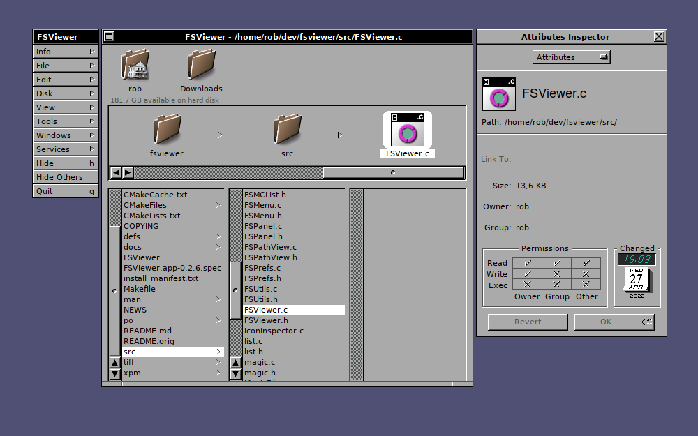

# FSViewer

## What is this?

FSViewer is a NeXT FileViewer lookalike for Window Maker. Viewing is currently
supported via browser mode and list mode. It has been written in C using the
WINGs library.

The tool was originally written by George Clernon (1998-99) and later maintained
by Guido Scholz (2002-07).

This version is based on a source code repository I created around the same time
to keep track of some fixes I added to the codebase over the years:

- Adapt window bottom to more closely resemble NeXT FileViewer
- Add support for showing available space on filesystem
- Switch build system to cmake
- Fix recurring crashes
- Fix main window not showing title bar
- Fix building on 64 bit systems
- Fix building on FreeBSD
- Fix building on OpenBSD

## Building from sources

1. Install prerequisites. This can be as easy as:

   - **Debian:** \
     `sudo apt install cmake libxpm-dev libwmaker-dev libwraster-dev libwings-dev libxmu-dev libpango1.0-dev`
   - **NetBSD:** \
     `sudo pkgin in cmake pkg-config windowmaker`
   - **OpenBSD:** \
     `doas pkg_add cmake windowmaker`

2. Build: `cmake . && make`

3. Install: `sudo make install`

## More information

- A list of all changes can be found in the [ChangeLog](./ChangeLog)
- Bugs and new features are tracked using
  [GitHub issues](https://github.com/roblillack/fsviewer/issues)
- Feel free to
  [start a discussion](https://github.com/roblillack/fsviewer/discussions)

For more information, please check the [original README](./README.orig).
